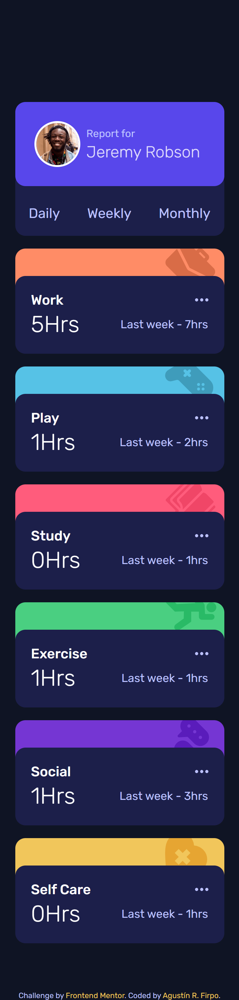
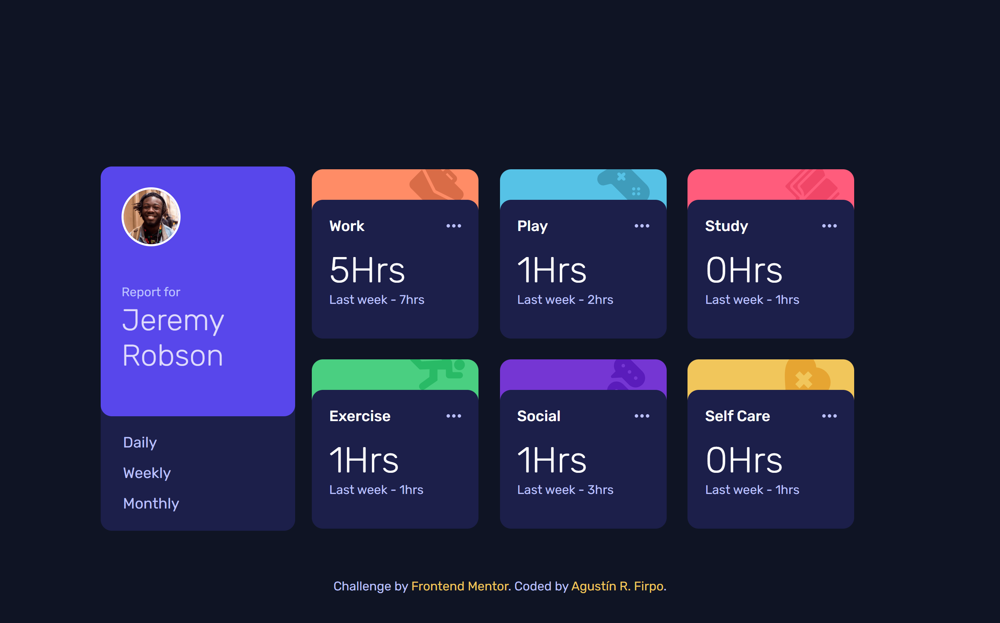
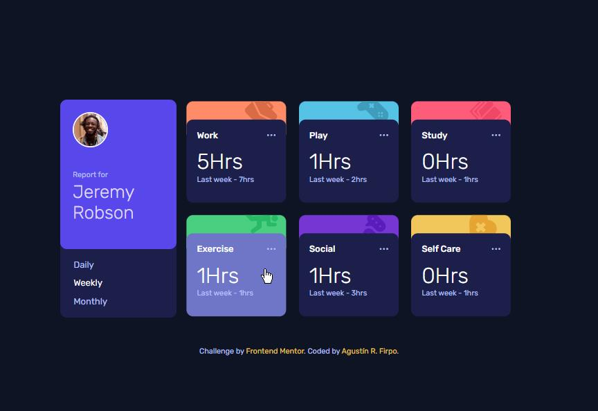
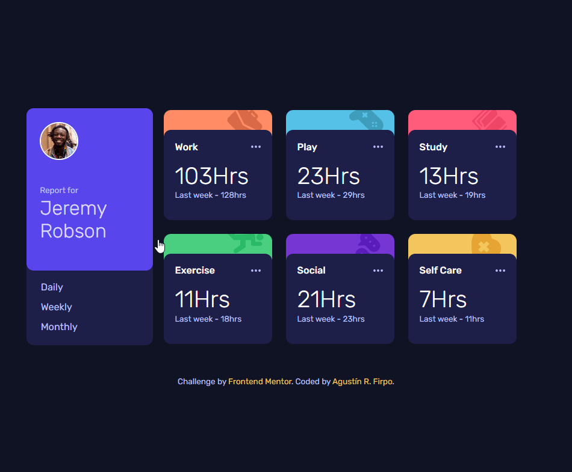

# Frontend Mentor - Time tracking dashboard solution

Hi everybody! 👋

This is a solution to the [Time tracking dashboard challenge on Frontend Mentor](https://www.frontendmentor.io/challenges/time-tracking-dashboard-UIQ7167Jw).

## Table of contents

- [Overview](#overview)
  - [The challenge](#the-challenge)
  - [Screenshot](#screenshot)
  - [Links](#links)
- [My process](#my-process)
  - [Built with](#built-with)
  - [What I learned](#what-i-learned)
- [Author](#author)

## Overview

### The challenge 🎯

Users should be able to:

- View the optimal layout for the site depending on their device's screen size

Mobile Layout



Desktop Layout



- See hover states for all interactive elements on the page



- Switch between viewing Daily, Weekly, and Monthly stats



### Links 🔗

- Solution Repository: [Github Repository](https://github.com/Arfirpo/time-tracking-dashboard-main)
- Solution Page: [Github Page](https://arfirpo.github.io/time-tracking-dashboard-main/)

## My process ⚙️

### Built with 🛠️

- Semantic HTML5 markup
- CSS custom properties
- Flexbox
- CSS Grid
- Mobile-first workflow
- Javascript
- Api/Json Files

### What I learned 📚

In this challenge i had the oportunity to learn another form to set a font in css.

````css
@font-face {
    font-family: 'Rubik';
    src: url(./font/Rubik-VariableFont_wght.ttf);
}````

Also, exercise the use of the for each function to create the activity cards on the page
````js
function drawElements(array){
    secondSection.innerHTML = '';
    array.forEach((element, index) => {
        let title = data[index].title;
        let titleLowerCase = title.toLocaleLowerCase();
        if(titleLowerCase == 'self care'){
            titleLowerCase = 'self-care'
        }
        secondSection.innerHTML += `
        <div class="card">
            <div class="card__background" style="background-color: ${bgColors[index]};">
                
            </div>
            <div class="card__details">
                <div class="card__activity">
                    <p class="card__title">${title}</p>
                    
                </div>
                <div class="card__time">
                    <p class="card__hour">${element.current}Hrs</p>
                    <p class="previous">Last week - ${element.previous}hrs</p>
                </div>
            </div>
        </div>`
    });
}
````

## Author  🙋🏻‍♂️

- Twitter/X - [@agus_firpo](https://twitter.com/agus_firpo)
- Frontend Mentor - [@Arfirpo](https://www.frontendmentor.io/profile/Arfirpo)
- Linkedin - [Agustín Rodrigo Firpo](https://www.linkedin.com/in/agustin-rodrigo-firpo-0aa86697/)